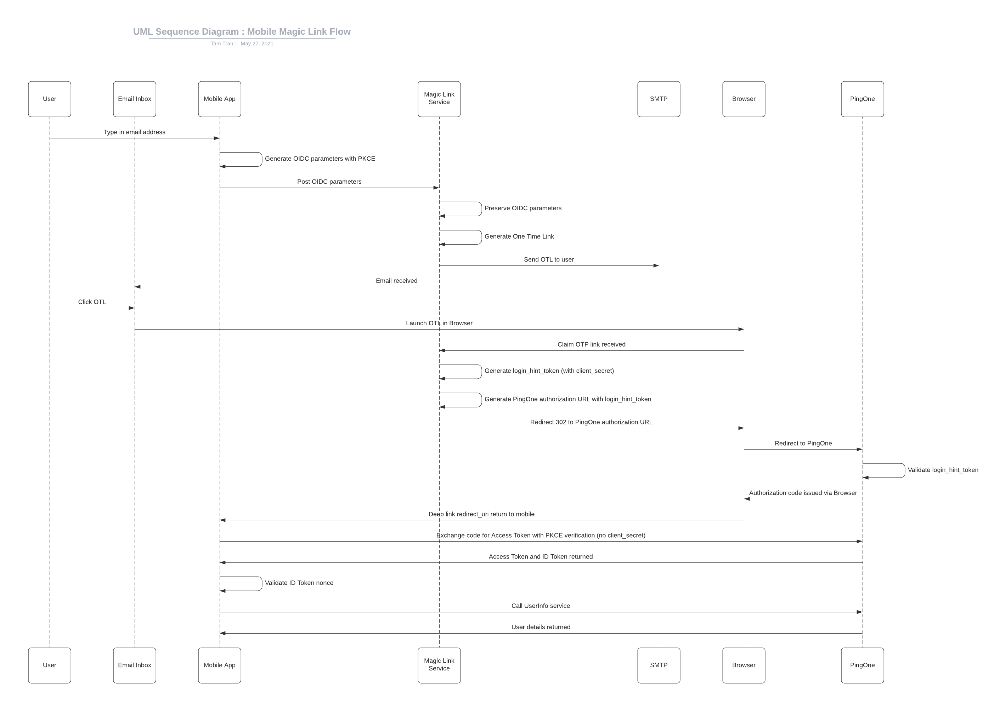

# PingOne Magic Link Solution

The PingOne Magic Link Service provides a passwordless authentication experience into a PingOne application using a One Time Link.

The Magic Link service performs the following actions:
1. Captures and temporarily stores an OIDC authorization request
   - A mobile application would send details of the request to this service.
2. Generates a One Time Link and emails it to the user.
3. Once claimed over email, the service generates an OIDC authorization url with a signed login_hint_token containing the email as the subject before redirecting the browser over a 302 response.
4. PingOne validates the login_hint_token and automatically logs the user in. An OIDC code or token is sent back to the redirect uri sent in step 1.
   - The flow will return to the mobile application if the redirect_uri is a mobile deep link.

## Sequence Diagram

This github project peforms the part of the "Magic Link Service" in the following diagram:

## PingOne Pre-requisites

The solution requires a MFA Only Authentication Policy, and an OIDC Client.

### MFA Only Authentication Policy

Create an MFA Only Policy with the following attributes:
- NONE OR INCOMPATIBLE METHODS: BYPASS

### OIDC Client

Create an OIDC Client with the following attributes:
- A generated Client Secret.
- Response Type: Code
- Grant Type: Authorization Code
   - PKCE Enforcement: S256_REQUIRED
- Token Endpoint Authentication Method: NONE
- Resources: add profile
- Policies: Select the MFA Only Policy you created above.

### Sample Users

This solution requires that the users entered into the mobile app exist with the following attributes:
- Username: email address of the user.
- MFA Enabled: true.

## Components

### Web Service

This solution requires you to launch a web service. Details and installation steps found [here](web-service).

### Android Application

This solution comes with a sample Android Application demonstrating the passwordless flow. Details and installation steps found [here](mobile-android).

## Test with Postman

Postman scripts [here](artefacts/postman.collection) have been required to test the solution out without a mobile application.

Important: The Magic Link web service needs to be running with devmode=true. This allows the Postman scripts to retrieve the OTL in the OIDC claim dropoff response.

Import the collection into postman and modify the following Collection Variables:

Configuration Name | Description | Example
--- | --- | ---
magiclink-baseurl | Frontend Base URL of the magic link service | https://magiclink.pingapac.com
magiclink-subject | Email address of the subject. User must exist in PingOne with username=email | bob@mailinator.com
pingone-baseurl | Auth Base URL of the PingOne environment | https://auth.pingone.com/{environmentId}
pingone-client_id | Client ID for the mobile application. | {clientId}
pingone-client_redirect_uri | Redirect URI configured in the client. | pingapac://magiclink/callback

Run the Postman steps in sequence.
